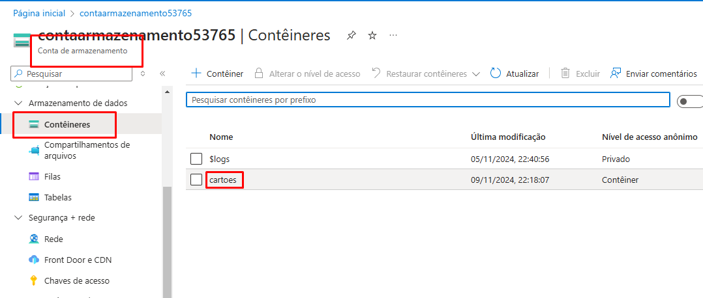
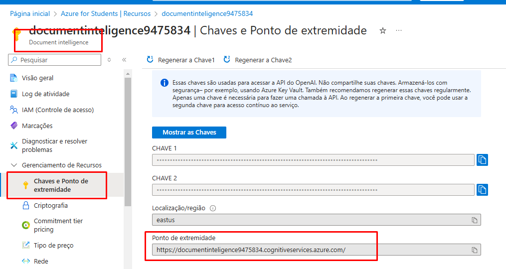
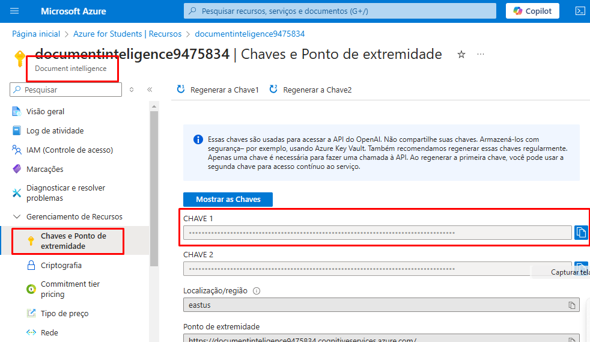

# Upload de Arquivos e Detecção de Cartão de Crédito com Azure

Este projeto permite o upload de imagens para o Azure Blob Storage, onde são processadas para detectar informações de cartões de crédito, utilizando o **Azure Document Intelligence**. A interface é construída com **Streamlit** para facilitar a interação com o usuário.

## Funcionalidades

- **Upload de Imagens**: Permite o upload de arquivos de imagem (formatos: PNG, JPG, JPEG) para o Azure Blob Storage.
- **Análise de Cartão de Crédito**: Utiliza o Azure Document Intelligence para extrair informações como nome do titular, número do cartão, banco emissor e data de validade.
- **Interface Intuitiva**: Exibe a imagem carregada e apresenta os resultados da análise indicando se o cartão é válido.

## Requisitos do Azure

Para rodar o projeto, é necessário configurar os seguintes serviços no Azure:

- **Conta de Armazenamento e Contêiner**: Usado para armazenamento das imagens carregadas.
- **Azure Document Intelligence**: Utilizado para a detecção e extração de informações de cartões de crédito nas imagens.


## Como Utilizar

### 1. Clone o Repositório

```bash
git clone <URL_DO_REPOSITORIO>
cd <NOME_DO_REPOSITORIO>

### 2. Configuração das Variáveis de Ambiente

Crie um arquivo `.env` na pasta `utils` e configure as seguintes variáveis:

- `ENDPOINT`: Endpoint do Azure Document Intelligence.
- `SUBSCRIPTION_KEY`: Chave de assinatura do serviço de Document Intelligence.
- `AZURE_STORAGE_CONNECTION_STRING`: String de conexão do Azure Blob Storage.
- `CONTAINER_NAME`: Nome do container criado no Blob Storage para armazenar as imagens.

### 3. Adicionar os requirements

- pip install -r requirements.txt

### 4. Rodar o programa

- Abrir no terminal a pasta src e utilizar `streamlit run .\app.py`


### Importante cuidas os acessos disopnibilizados no Azure, a aplicação deve possuir acesso para poder adicionar as imagens, ler e utilizar o Document Intelligence


## Onde obter os dados:

- CONTAINER_NAME

- AZURE_STOREGE_CONNECTION_STRING: 

- ENDPOINT: 

- SUBSCRIPTION-KEY: 


